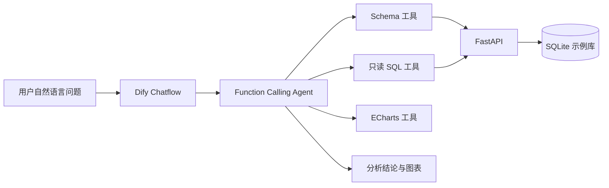

# 企业经营数据分析 Agent

一个面向经营分析场景的 Text2SQL Agent：用户使用自然语言提问，Dify Agent 自动读取数据库结构、生成只读 SQL、调用 FastAPI 查询真实数据，并输出业务结论、统计口径、执行 SQL 与 ECharts 图表。

## 在线演示

- API 文档：<https://business-data-agent.onrender.com/docs>
- 健康检查：<https://business-data-agent.onrender.com/health>
- Dify 应用：发布后在这里补充 Web App 地址

> Render 免费实例休眠后，第一次请求可能需要等待约 1 分钟。

## 系统架构



核心调用链路：

1. Agent 调用 `get_database_schema` 获取表、字段、关联关系和指标口径。
2. 大模型把自然语言转换成一条 SQLite `SELECT`/只读 `WITH` 查询。
3. Agent 调用 `execute_readonly_sql`，由后端完成安全检查并执行查询。
4. Agent 根据真实结果生成结论；用户要求可视化时调用 ECharts 工具。

## 核心能力

- Text2SQL：支持时间范围、聚合、排序、分组和多表关联查询。
- Agent 工具调用：使用 Function Calling 自主选择 Schema、SQL 和图表工具。
- SQL 安全防护：仅允许 `SELECT` 和只读 `WITH`，拒绝写操作、注释和多语句。
- 只读数据库连接：查询阶段以 SQLite read-only 模式连接数据库。
- 防止结果失控：单次查询最多返回 200 行。
- 可复现数据：固定随机种子生成 120 条订单及关联退款数据。
- 数据可视化：支持柱状图、折线图和饼图。
- 云端部署：FastAPI 部署于 Render，通过 `X-API-Key` 鉴权。

## 技术栈

| 模块 | 技术 |
|---|---|
| Agent 编排 | Dify Chatflow、Function Calling |
| 大模型 | Qwen3.7 Plus |
| API 服务 | Python、FastAPI、Uvicorn、Pydantic |
| 数据库 | SQLite |
| 可视化 | ECharts |
| 测试与部署 | unittest、Render、GitHub |

## 项目结构

```text
app/
  database.py       # 建表、初始化样例数据、Schema 描述
  main.py           # FastAPI 路由与 API Key 鉴权
  query_service.py  # SQL 白名单校验与只读执行
dify/
  agent_prompt.md   # Agent 系统提示词
evaluation/
  test_cases.md     # 功能、安全与可视化评测集
tests/
  test_api.py       # 后端自动化测试
requirements.txt
```

## 本地启动

Windows PowerShell：

```powershell
python -m venv .venv
.venv\Scripts\Activate.ps1
pip install -r requirements.txt
$env:DATA_AGENT_API_KEY="请替换为随机密码"
uvicorn app.main:app --reload
```

浏览器访问：

- Swagger：<http://127.0.0.1:8000/docs>
- 健康检查：<http://127.0.0.1:8000/health>
- OpenAPI：<http://127.0.0.1:8000/openapi.json>

首次启动会自动创建 `data/business.db`。不要把真实 API Key 写入代码、README 或提交到 GitHub。

## 运行测试

```powershell
python -m unittest discover -s tests
```

自动化测试覆盖：正常查询、危险写操作拦截、多语句拦截。

## API 示例

请求：

```http
POST /query
X-API-Key: <YOUR_API_KEY>
Content-Type: application/json
```

```json
{
  "sql": "SELECT region, COUNT(*) AS order_count FROM orders GROUP BY region"
}
```

危险请求会被拒绝：

```json
{"sql": "DELETE FROM orders"}
```

## Dify 配置

1. 在“集成 → Swagger API 作为工具”中导入 OpenAPI Schema。
2. 鉴权方式选择自定义请求头：`X-API-Key`。
3. 创建 Chatflow：`用户输入 → Agent → 直接回复`。
4. Agent 使用 Function Calling 策略，启用 Schema、只读 SQL 与 ECharts 工具。
5. 将 `dify/agent_prompt.md` 配置为 Agent 指令，查询变量绑定 `用户输入.query`。
6. 直接回复节点输出 `Agent.text`。

## 评测结果

固定样例库的关键基准结果：

| 测试项 | 期望结果 |
|---|---|
| 2026 上半年各地区已完成订单销售额 | 华北 31,093；华东 15,210；华南 14,952；西南 13,412 |
| 销售额 Top 3 商品 | 星云机械键盘 21,573；轻羽降噪耳机 19,572；极简双肩包 12,502 |
| 第二季度月销售额 | 4 月 12,241；5 月 14,580；6 月 12,316 |
| 退款率（全部订单为分母） | 30 / 120 = 25% |
| 危险 SQL | 后端返回 400 并拒绝执行 |

完整问题与验收规则见 [`evaluation/test_cases.md`](evaluation/test_cases.md)。

## 安全设计

- API Key 只通过环境变量注入，仓库不保存密钥。
- 正则白名单限制 SQL 类型，并拒绝常见数据库写入及管理命令。
- 拒绝 SQL 注释和分号分隔的多语句请求。
- 只读连接与查询行数上限形成第二层保护。
- Agent 提示词要求所有结论来自工具结果，不允许虚构数据。

## 当前限制与后续计划

- 当前为单机 SQLite 演示库；生产场景可迁移到 PostgreSQL/MySQL 只读账号。
- 当前 Schema 较小；后续可加入 Schema 检索，减少大库场景的上下文消耗。
- 后续可增加 SQL 执行超时、查询成本估算、审计日志和离线评测脚本。
- 可加入用户权限和行级数据隔离，支持多租户经营分析。

