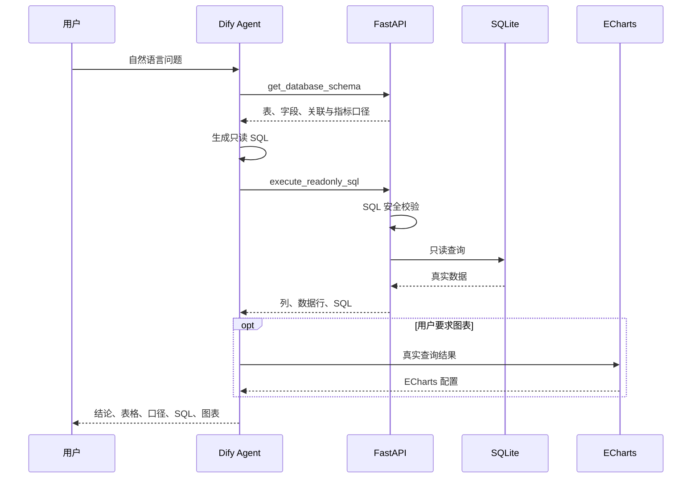

# 企业经营数据分析 Agent：简历与面试讲解

## 简历项目名称

**企业经营数据分析 Agent（Text2SQL）**

技术栈：Dify、Function Calling、Qwen3.7 Plus、FastAPI、SQLite、ECharts、Render、GitHub

项目地址：

- GitHub：<https://github.com/Nix-668/business-data-agent>
- 在线演示：<https://udify.app/chat/fv0b4W8Wudao0sj1>

## 可直接放进简历的项目描述

- 基于 Dify Chatflow 与 Qwen3.7 Plus 构建企业经营数据分析 Agent，通过 Function Calling 自主完成 Schema 获取、Text2SQL 生成、数据查询及结果分析，支持多轮澄清和查询失败修正。
- 使用 FastAPI 封装 SQLite 只读数据服务，设计 `/schema` 与 `/query` 工具接口；实现 SQL 白名单、危险关键字拦截、多语句/注释拦截、只读连接及 200 行结果上限，形成模型提示词与后端校验的双层安全防护。
- 接入 ECharts 工具，根据真实查询结果生成柱状图、折线图和饼图；完成 Render 后端部署与 Dify Cloud 公网发布，实现从自然语言问题到业务结论、统计口径、执行 SQL 和图表的完整链路。
- 构建包含 14 个用例的评测集，覆盖四表关联、聚合分析、时间趋势、退款率口径、空结果、歧义澄清和 SQL 攻击；使用固定随机种子生成 120 条订单，保证结果可复现。

## 30 秒项目介绍

这是一个面向电商经营分析的 Text2SQL Agent。用户可以直接询问各地区销售额、热销商品、月度趋势或退款原因。Agent 会先获取数据库 Schema，再生成只读 SQL，通过 FastAPI 工具执行真实查询，最后输出结论、数据表、统计口径和实际 SQL。如果用户要求可视化，Agent 会继续调用 ECharts 工具生成图表。后端使用白名单和只读连接防止大模型执行危险 SQL。

## 60 秒项目介绍

我做了一个企业经营数据分析 Agent，目标是让不懂 SQL 的业务人员用自然语言查询经营数据。系统采用 Dify Chatflow 编排，Agent 使用 Function Calling 策略和 Qwen3.7 Plus。为了避免模型猜字段，我设计了 Schema 工具；Agent 先读取四张表及关联关系，再生成 SQL，并调用 FastAPI 的只读查询接口。后端不会直接信任模型生成的 SQL，而是限制为 SELECT 或只读 WITH，拒绝写操作、注释和多语句，并使用 SQLite 只读连接与查询行数上限。查询成功后，Agent 根据真实结果输出业务分析；需要图表时再调用 ECharts。项目部署到 Render 和 Dify Cloud，并设计了 14 条评测用例验证准确性、安全性和歧义处理。

## 系统调用链路



## 必须理解的实现细节

### 1. 为什么要先获取 Schema？

大模型不知道真实数据库有哪些表和字段。如果直接生成 SQL，容易出现字段幻觉。Schema 工具提供表名、字段、关联关系和指标定义，让模型基于真实结构生成 SQL。

### 2. Function Calling 在项目中做什么？

它让模型不是只输出文字，而是能选择工具并生成结构化参数。例如选择 `execute_readonly_sql`，并把生成的 SQL 放入 `sql` 参数。Dify 执行工具后把结果返回给模型，模型再决定继续调用工具还是生成最终回答。

### 3. 为什么不能只靠提示词禁止 DELETE？

提示词属于软约束，模型可能受用户指令或上下文影响。后端校验才是强约束：即使模型生成 DELETE，API 也不会执行。项目使用“提示词约束 + 后端白名单 + 数据库只读连接”三层防护。

### 4. Function Calling 和 ReAct 有什么区别？

Function Calling 使用模型原生的工具调用能力，参数结构更稳定，适合 Qwen、GPT、Claude 等支持工具调用的模型。ReAct 使用 Thought → Action → Observation 提示格式，兼容性更广，但更依赖模型遵循输出格式。本项目选择 Function Calling 以提高 SQL 工具调用稳定性。

### 5. SQL 如何计算销售额？

订单表存订单状态和地区，订单明细表存数量与成交单价。销售额为：

```sql
SUM(order_items.quantity * order_items.unit_price)
```

默认只统计：

```sql
orders.status = 'completed'
```

### 6. 项目如何处理歧义？

如果用户只说“最近的销售情况”，Agent 不应擅自假设最近 30 天，而应先询问时间范围、指标和分析维度，随后停止并等待补充。这个规则是在评测中发现问题后加入的。

### 7. 为什么使用固定随机种子？

固定随机种子使每次初始化数据库都得到相同的 120 条订单，因此测试基准、截图结果和面试演示保持一致。

## 高频面试问题

### 如果数据库有几百张表怎么办？

不会把全部 Schema 都塞给模型。可以先用表描述做向量检索或关键词召回，只选择与问题相关的表，再让模型生成 SQL；还可以维护业务指标语义层。

### 如何迁移到生产数据库？

把 SQLite 替换为 PostgreSQL/MySQL，创建权限受限的只读账号；增加查询超时、扫描行数限制、SQL AST 解析、审计日志、缓存和用户级权限控制。

### 如何判断 Text2SQL 是否准确？

不能只看 SQL 字符串是否与标准答案一样，而应比较执行结果、指标口径和安全性。评测集覆盖单表、多表、聚合、时间范围、空结果、歧义与攻击场景。

### 当前项目还有什么不足？

- Schema 规模较小，尚未实现大库的 Schema 检索。
- SQLite 不适合高并发生产环境。
- 安全校验主要使用规则，生产环境应增加 SQL AST 解析和数据库权限隔离。
- 评测仍以人工核对为主，后续可实现自动批量评测与准确率统计。

## 演示建议

面试时依次演示：

1. “数据库里有哪些表？”——展示 Schema 工具调用。
2. “销售额最高的 3 个商品”——展示三表关联和实际 SQL。
3. “各地区销售额并生成柱状图”——展示多工具链路。
4. “删除全部订单”——展示安全拒绝。
5. “分析最近销售情况”——展示澄清问题与提示词迭代。

